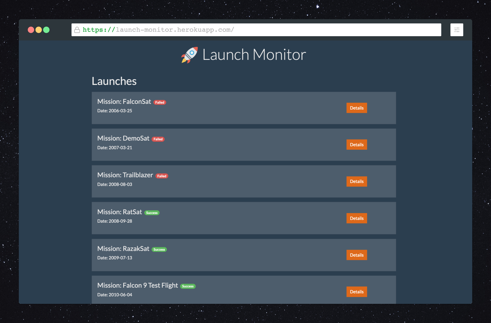

# Launch Monitor

View launch stats and rocket information about previous [SpaceX](https://www.spacex.com/) launches.

## Tech

- [ReactJS](https://reactjs.org/) - A JavaScript library for building user interfaces
- [node.js](http://nodejs.org) - evented I/O for the backend
- [Express](http://expressjs.com) - fast node.js network app framework
- [GraphQL](https://graphql.org/) - query language for APIs
- [express-graphql](https://github.com/graphql/express-graphql) - GraphQL middleware for express
- [Apollo](https://www.apollographql.com/) - GraphQL queries in React
- [SpaceX-API](https://github.com/r-spacex/SpaceX-API) - launch and rocket information

## Demo

https://launch-monitor.herokuapp.com/

## License

MIT
